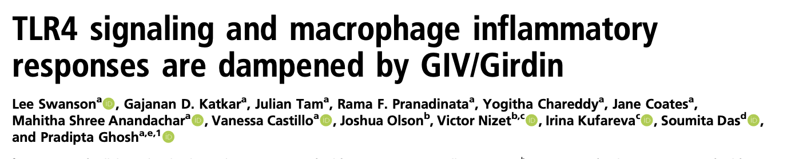
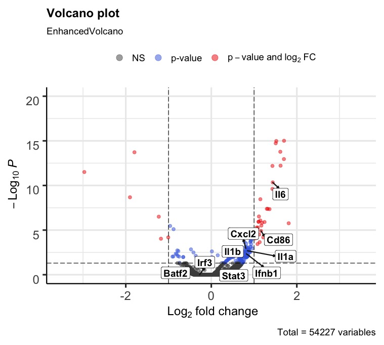

# TLR4 signaling and macrophage inflammatory responses are dampened by GIV/Girdin

https://pubmed.ncbi.nlm.nih.gov/33055214/

## Experiment Details: RAW macrophage shRNA + LPS 

RAW macrophages WT (shRNA control) or knocked down for GIV protein (either with shRNA1 or shRNA2) were treated with LPS for 5 hours and analyzed for differential gene expression analysis. 3 samples were sent for single-end RNA sequencing:

    1. RAW Macs knockdown for Giv with shRNA1
        "RAW_sh1_GIV_LPS_5hr_S4_L008_R1_001.fastq"
    2. RAW macs knockdown for Giv with shRNA2
        "RAW_sh2_GIV_LPS_5hr_S6_L008_R1_001.fastq"
    3. RAW mac with scRNA control
        "RAW_shC_LPS_5hr_S2_L008_R1_001.fastq"

## The overall strategy for the analysis of these samples was to:

    1. Creat and index and quantify transcript counts by using Salmon
        Snakemake was used to manage enviroments and conduct workflow
    2. annotate transcript to genes using tximport
    3. DE analysis by DESeq2

### Creating an index for the mouse transcriptome

The transcriptome from Genecode `gencode.v33.transcripts.fa` was used to create an index using the 
following Salmon code
`salmon index --gencode -t transcript/gencode.vM24.transcripts.fa.gz -i index/gencode.vM24_salmon_1.1.0`

### Quantifying samples

The snakefile describes the work workflow generating  Salmon quant.sf files.

### Annotation of transcripts and DE analysis

The R scipt titled `R_script_DE_analysis.R` has the steps of tximport and DESeq2.

### Submitted results to GEO

The sequencing files were submitted to GEO (public database)

### Version of Software/tools

1. Salmon 1.1.0
2. Mouse Transcriptome from gencode.vM24
3. tximport annotations from gencode.vM24.annotation.gff3
4. snakemake 5.10.0 (from bioconda)
